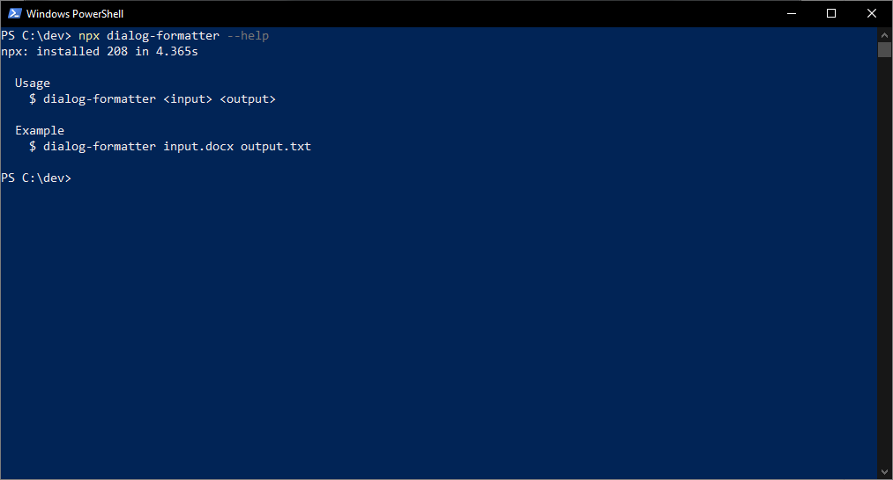

# 📜 dialog-formatter

CLI app for extracting and formatting dialog scripts from `.docx` to `.txt`



## ⚡ Deployment

These instructions will get you a release of this project up and running on your local machine, so that you can start using it.

### 📋 Prerequisites

* [textutil](https://ss64.com/osx/textutil.html) - Command line text utility
  * comes with OS X/macOS 10.4 or newer
* [Node.js](https://nodejs.org) - JavaScript run-time environment

### 🚀 Getting Started

```bash
## variant A
# run without installation
npx dialog-formatter <args>

## variant B
# install globally
npm i -g dialog-formatter
# run
dialog-formatter <args>

## variant C
# install locally
npm i dialog-formatter
# run
npx dialog-formatter <args>
```

## 📄 Document Format

### 📥 Input `.docx`

* lines only containing whitespace are ignored
* if a line contains at least one tab, then the text after the last tab is interpreted as dialog
* otherwise the entire content of the line is interpreted as the name of the character currently speaking

#### 💡 Example

```
                  DEEP THOUGHT
21:42:30: Alright. The answer to the ultimate question ...

                  LUNKWILL
21:42:33: Yes ...

                  DEEP THOUGHT
21:42:35: ... of Life, the Universe, and Everything ...

                  FOOK
21:42:38: Yes!

                  DEEP THOUGHT
21:42:39: ... is ...

                  CROWD
21:42:41: Yes ...!

                  DEEP THOUGHT
21:42:42: Forty two.
```

### 📤 Output `.txt`

* each line of dialog from the input `.docx` produces one line in the output `.txt`
* each line has the format `<speaking-character>  <dialog>`
  * whitespace at the beginning and end of both the speaking character and the dialog are removed beforehand

#### 💡 Example

```
DEEP THOUGHT Alright. The answer to the ultimate question ...
LUNKWILL Yes ...
DEEP THOUGHT ... of Life, the Universe, and Everything ...
FOOK Yes!
DEEP THOUGHT ... is ...
CROWD Yes ...!
DEEP THOUGHT Forty two.
```

## 🛠️ Development

These instructions will get you a copy of this project up and running on your local machine for development and testing purposes.

### 📋 Prerequisites

#### Software

* [Node.js](https://nodejs.org) - JavaScript run-time environment

#### VS Code Extensions

This project is intended to be used with Visual Studio Code and the following extensions are recommended:

* [ESLint](https://marketplace.visualstudio.com/items?itemName=dbaeumer.vscode-eslint) - Integrates ESLint JavaScript into VS Code

## 🧰 Built With

* [meow](https://github.com/sindresorhus/meow) - CLI app helper
* [tmp](https://github.com/raszi/node-tmp) - Temporary file and directory creator for node.js

## 👨‍💻 Authors

* **Robin Hartmann** - [robin-hartmann](https://github.com/robin-hartmann)

## 📃 License

This project is licensed under the MIT License - see the [LICENSE](LICENSE) file for details
